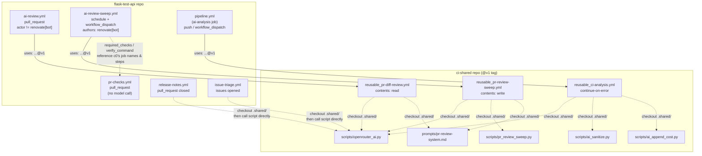
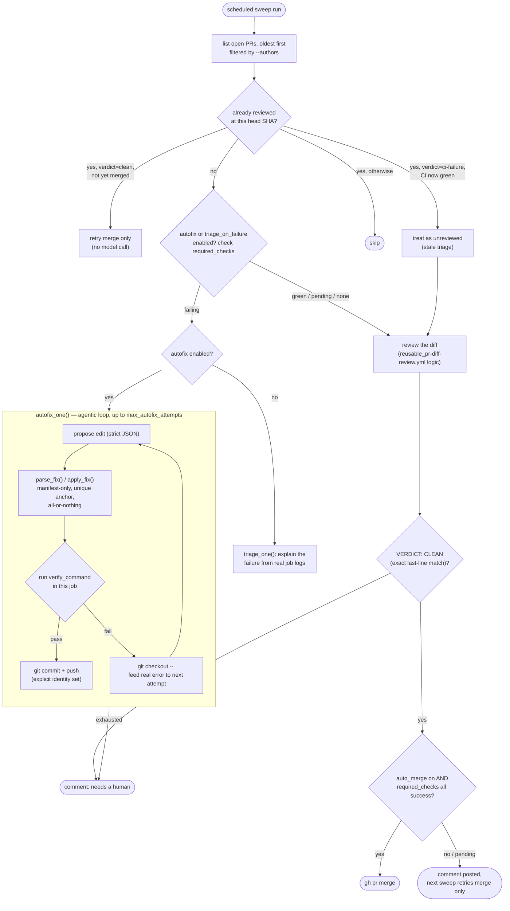
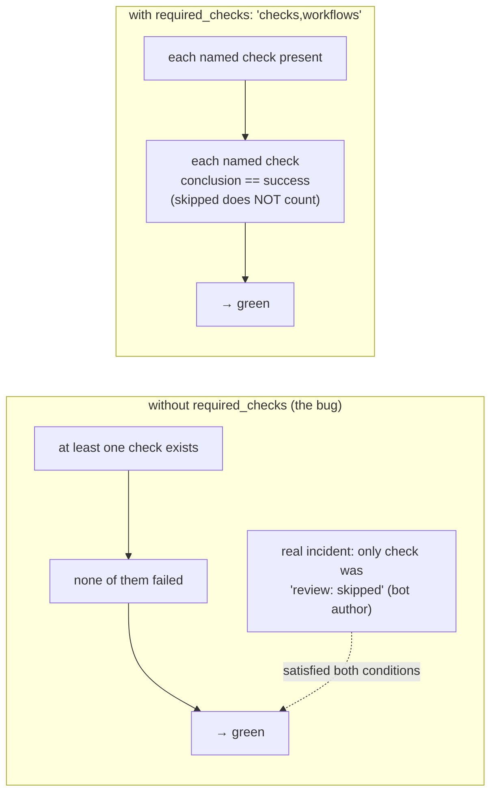

# ci-shared — Architecture

This repo centralizes reusable GitHub Actions workflows and their Python
scripts, so consumer repos (`flask-test-api`, and later others) stop
duplicating the same AI-review logic byte-for-byte. It was extracted after
finding `scripts/openrouter_ai.py` and most of `ai-review.yml` copy-pasted
identically between `flask-test-api` and `cloudflare-free-exporter`.

No Claude API, no Claude Code routines. Every call goes through
`scripts/openrouter_ai.py`, a stdlib-only Python client for any
OpenAI-compatible chat-completions endpoint (default: OpenCode Zen,
`https://opencode.ai/zen/v1/chat/completions`). The default model,
`deepseek-v4-flash-free`, went fully unavailable from the provider mid-project
(verified with a direct `curl` against the endpoint, not assumed); consumers
override via `OPENROUTER_MODEL` — `flask-test-api` currently runs `hy3-free`.

## Versioning

Consumers pin `@v1` (a moving tag on `main`), never `@main` directly. Every
`Checkout shared scripts` step inside the reusable workflows uses a
**literal** `ref: v1` — not a dynamically resolved ref. `github.workflow_ref`
inside a called reusable workflow resolves to the **caller's** ref (observed:
a consumer PR's merge ref, `refs/pull/88/merge`) — not the tag pinned in this
repo's own `uses:` line. There is no context value that reflects "the ref
this file was itself fetched at." Because the checkout step's `ref: v1` line
ships as part of the `v1` tag's own file content, bumping the tag and
updating that literal happen in the same commit by construction — they
cannot drift apart. (This was tried the dynamic way first; it failed with
`couldn't find remote ref refs/pull/88/merge` the first time a consumer's
`pull_request`-triggered run hit it.)

## Repo layout

```
ci-shared/
├── .github/workflows/
│   ├── reusable_pr-diff-review.yml    review + comment only, contents: read
│   ├── reusable_pr-review-sweep.yml   scheduled sweep: review, merge, self-repair
│   ├── reusable_ci-analysis.yml       post-pipeline informative report
│   └── test.yml                       CI for this repo's own scripts
├── prompts/
│   └── pr-review-system.md            shared review prompt template, one source of truth
├── scripts/
│   ├── openrouter_ai.py    minimal OpenAI-compatible chat-completions client
│   ├── ai_sanitize.py      redact secrets / cap size before sending to the model
│   ├── ai_append_cost.py   append a token-usage/cost footer to a report
│   ├── render_prompt.py    fills the shared template with per-caller context
│   └── pr_review_sweep.py  the sweep's own logic — review, merge gate, triage, autofix
├── tests/
│   ├── test_openrouter_ai.py     13 tests, mocked HTTP server, no network calls
│   └── test_pr_review_sweep.py   50 tests — verdict parsing, checks_state, autofix guardrails
├── README.md               quick-start / inputs reference
└── docs/architecture.md    this file
```

`reusable_pr-diff-review-and-merge.yml` existed briefly and is gone —
superseded by the sweep below, which does the same job without its
permission-model problems. See "Why the sweep, not the merge-wrapper file"
further down; the history is worth reading even though the file itself is
deleted, because the reason it failed is not obvious from the sweep alone.

---

## File: `scripts/openrouter_ai.py`

Stdlib-only (`urllib`, no `requests`), so it runs on any Ubuntu runner with
no `pip install` step. Reads config from the environment
(`OPENROUTER_API_KEY`, `OPENROUTER_MODEL`, `OPENROUTER_ENDPOINT`,
`OPENROUTER_SITE_URL`, `OPENROUTER_APP_NAME`), takes `--system-file` /
`--prompt-file`, prints only the model's reply to stdout.

Key behaviors:
- **Redaction is defense-in-depth**: the API key and common secret patterns
  (`sk-or-v1-…`, `ghp_…`, PEM blocks) are stripped from anything printed,
  even error messages.
- **Truncation**: both prompts are capped at `--max-chars`; oversized input
  is truncated with a marker, never silently dropped.
- **Empty-reply retry**: reasoning models can burn their entire output
  budget on chain-of-thought and return blank `content`. On that, it retries
  with a doubled `max_tokens` and an explicit "answer directly" nudge, up to
  `--retries` times (default 3), before falling back to the raw
  `reasoning_content` if that's all that came back.
- **Cost estimate**: `--usage-file` writes a JSON blob (tokens + estimated
  USD cost from a small hardcoded price table, `MODEL_PRICES_USD_PER_1M`)
  that `ai_append_cost.py` turns into a Markdown footer.

## File: `scripts/ai_sanitize.py`

Three independent modes selected by flag:
- **bundle** (default): concatenates input files, redacting secret patterns
  in each, caps total output at `--max-bytes`. Used to build the combined
  CI-context prompt for `reusable_ci-analysis.yml`.
- **`--check FILE`**: exit 1 if `FILE` contains a secret pattern, used
  nowhere currently that changes behavior — kept for pipelines that want a
  hard gate.
- **`--redact-file FILE`**: in-place mask, used on the **final AI report**
  before upload — a security review legitimately quotes source lines like
  `password = "x"`; this must never cause the whole report to be dropped,
  only the matched substrings masked.

## File: `scripts/ai_append_cost.py`

Pure formatting: reads the `--usage-file` JSON from `openrouter_ai.py` and
appends a `## 🤖 AI Usage & Cost` section to a report file.

## File: `prompts/pr-review-system.md` + `scripts/render_prompt.py`

The review prompt used to be duplicated inline inside
`reusable_pr-diff-review.yml`'s `actions/github-script` step. Pulled out to a
template file with one `{{PROJECT_CONTEXT}}` placeholder so the sweep and the
plain reviewer share the exact same base prompt — most importantly the
`VERDICT: CLEAN | NEEDS_REVIEW` contract that auto-merge reads. Two
duplicated copies of that contract would have been one edit away from
silently disagreeing.

`render_prompt.py` fills the placeholder from two additive, optional
sources: `--extra` (a caller-specific string, e.g. "this PR is a dependency
bump") and `--rules-file` (a file in the *consumer* repo,
`.github/ai-review-rules.md`, if it exists — this is where a project keeps
its own durable review guidance without forking anything in this repo).

---

## File: `.github/workflows/reusable_pr-diff-review.yml`

The core building block, unchanged in shape since it was first extracted.
`workflow_call` with:

| Input | Default | Purpose |
|---|---|---|
| `system_prompt_extra` | `''` | Caller-specific prompt addendum (e.g. "this PR is a dependency bump") |
| `comment_marker` | `<!-- ai-code-review -->` | HTML marker to find/update this bot's own comment (lets two callers coexist without fighting over one comment) |
| `comment_heading` | `AI Code Review` | Markdown heading shown above the review |
| `max_chars` | `140000` | Diff chars sent to the model |
| `timeout_seconds` | `120` | HTTP timeout |
| `openrouter_model` / `_endpoint` / `_site_url` / `_app_name` | `''` | Forwarded from the caller's repo vars — `workflow_call` does **not** inherit `vars.*` automatically |

Secret: `openrouter_api_key` (optional — empty means "skip the AI call, post
a did-not-run comment").

Output: `clean` — `"true"` only if the review ran **and** its exact last
line was `VERDICT: CLEAN`.

Job permissions: `contents: read`, `pull-requests: write`. **Never
requests `contents: write`** — this file is meant to be safe to run on
arbitrary/human/fork PRs, including from untrusted contributors.

### Steps (in order)

1. **Checkout caller repo** at `ref: github.event.pull_request.head.sha`
   explicitly — not the default ref. The default differs by trigger:
   `pull_request` checks out a synthetic merge commit
   (`refs/pull/N/merge`), `pull_request_target` checks out the **base**
   branch (not the PR at all). `head.sha` is the one ref that is correct
   for both, so the file behaves identically regardless of which trigger a
   caller uses.
2. **Checkout shared scripts** — `lorenzogirardi/ci-shared@v1` (literal, see
   Versioning above) into `.shared/`.
3. **Read project-specific review rules, if any** — if the *caller* repo has
   `.github/ai-review-rules.md`, its content is read and merged into the
   rendered prompt via `render_prompt.py`.
4. **Prevent fork secret exfiltration** — if
   `github.event.pull_request.head.repo.fork == true`, blanks
   `OPENROUTER_API_KEY` in `$GITHUB_ENV` for the rest of the job. Untrusted
   fork code never gets a real key.
5. **Build diff** — `git diff base...head`, with a long `:(exclude)` list
   (secrets, binaries, `node_modules`, `dist`, etc.), capped and redirected
   to `.ai/diff.txt`.
6. **Run AI review** — skips (with a `::warning::`) if the key is empty;
   otherwise calls `openrouter_ai.py`, writes `.ai/review.md`.
   `continue-on-error: true` — a failed model call never fails the job.
7. **Post or update AI review comment** — finds an existing comment by
   `comment_marker`, updates it, else creates one. Strips the `VERDICT:`
   line before posting (it's a machine-readable contract, not a human
   reader's business). If `.ai/review.md` doesn't exist (skipped or
   failed), posts a "did not run" placeholder instead of silently doing
   nothing.
8. **Compute clean verdict** — `clean=true` only if `.ai/review.md` exists
   **and** `tail -n 1` of it is exactly the string `VERDICT: CLEAN`. Exact
   match, not a substring `grep` — see "Why exact-match, not grep" below.

### Why exact-match, not grep

The first version checked `grep -qi '\[critical\]' .ai/review.md`. That
false-positives on any sentence *mentioning* the tag — a model writing
*"no [Critical] issues found"* to say the PR is clean would still match and
block a merge for the wrong reason, and conversely a model that forgets the
exact bracket casing could produce a false clean. Forcing one dedicated,
mechanically-parsed last line (mirroring the strict-JSON pattern
`issue-triage.yml` uses in `flask-test-api` for the same class of problem —
an automated decision reading model output) removes that ambiguity entirely:
either the last line is the exact string or it isn't.

---

## File: `.github/workflows/reusable_pr-review-sweep.yml` + `scripts/pr_review_sweep.py`

The main event, and the file everything below revolves around. A
**scheduled** sweep (`workflow_call`, meant to be triggered by a `schedule` +
`workflow_dispatch` caller — not `pull_request`) that walks open PRs and, for
each one not yet reviewed at its current head SHA: reviews it, merges it if
the review **and CI** are both clean, or — opt-in — repairs it if CI is red.

### Inputs

| Input | Default | Purpose |
|---|---|---|
| `authors` | `''` (all) | Comma-separated PR author logins to sweep |
| `max_prs` | `10` | Cap per run (bounds model spend) |
| `auto_merge` | `false` | Merge PRs whose review is clean **and** whose CI is green |
| `required_checks` | `''` | Check-run names that must show `conclusion: success` — see "The merge gate" below |
| `merge_method` | `squash` | |
| `triage_on_failure` | `false` | On red CI, explain the failure instead of reviewing the diff |
| `autofix` | `false` | On red CI, push a *verified* fix instead of only explaining. Implies `triage_on_failure`. |
| `python_version` | `3.12` | Interpreter `verify_command` runs under |
| `verify_command` | `''` | Shell command that proves an autofix edit works, run before pushing anything |
| `verify_timeout_seconds` | `180` | |
| `max_autofix_attempts` | `3` | Propose→verify rounds tried locally, in this job, before giving up on one PR |

Secret: `openrouter_api_key` (required).

Job permissions: `contents: write`, `pull-requests: write` — this file
*does* need write, unlike the plain reviewer, which is exactly why it is a
separate file (see below).

### Why a sweep, not another `pull_request` trigger

The event-driven approach was tried first, in three stages, each one
discovered by a real failure, not anticipated in advance:

1. **`pull_request` + an actor gate on `github.actor`.** Broke immediately:
   GitHub gives `pull_request`-triggered runs a **read-only `GITHUB_TOKEN`
   and no repo secrets** when the actor is a bot. This is documented for
   `dependabot[bot]` specifically — it turned out **not** to be
   Dependabot-specific. Requesting `contents: write` on a `pull_request` run
   for `renovate[bot]` (same-repo, not a fork) was rejected identically:
   `"is only allowed 'contents: read'"`.
2. **`pull_request_target`**, the usual fix for #1 — it always runs with the
   base repo's full token/secrets regardless of actor. Fixed the permission
   problem, introduced a new one: its default checkout is the **base**
   branch, not the PR at all (the plain reviewer's `head.sha` fix handles
   this, but it's a sharp edge worth knowing about). Neither #1 nor #2 can
   retroactively fire for a PR opened before the workflow existed — an
   event trigger only ever fires on a future event.
3. **A scheduled sweep** (current). A `schedule` run has no PR actor and no
   fork to begin with, so problem #1 doesn't exist. It also naturally picks
   up every PR opened before it existed, on its very first run — no
   close/reopen trick needed. Confirmed by reading
   [`openwrt/openwrt`'s real `llm-review.yml`](https://github.com/openwrt/openwrt/blob/master/.github/workflows/llm-review.yml)
   (a public repo, inspected directly): `cron '0 3,15 * * *'` +
   `workflow_dispatch`, **no `pull_request` trigger at all**, and its last
   15 runs were all green.

### Why this replaced `reusable_pr-diff-review-and-merge.yml`

That file (now deleted) was a separate reusable workflow, nesting the plain
reviewer plus a `merge` job, called from a `pull_request_target`-triggered
wrapper. It hit the exact same problem #1/#2 above, plus one more specific
to nested reusable workflows: a job that omits its own `permissions:` block
inherits from **that file's own top-level `permissions:` block**, not from
the caller. The wrapper's top-level `permissions: {}` (copied from the plain
reviewer without accounting for this) silently capped the nested review job
to `contents: none, pull-requests: none` regardless of what the outer caller
granted — a second, independent permission bug layered on top of the first.
The sweep sidesteps both classes of problem by never being triggered by a PR
event in the first place.

### Dedup

Each PR gets **one** sweep comment (marker `<!-- ai-review-sweep -->`),
updated in place, carrying two hidden lines: `reviewed-sha: <sha>` and
`verdict: clean | needs-review | ci-failure`. A PR whose comment already
names its current head SHA is skipped — re-running the sweep costs nothing
and never double-posts — **except** two cases where the marker alone would
be wrong to trust:

- **`verdict: clean` but not yet merged** — the PR was reviewed clean last
  time but CI had not finished (or auto-merge was off). The sweep retries
  *only the merge*, without paying for another model call.
- **`verdict: ci-failure` but CI is green now** — a flaky job re-run turned
  red into green at the same SHA. The old triage/autofix comment is now
  stale (it explained a failure that no longer exists), so the sweep treats
  the PR as unreviewed and reviews it properly instead of leaving a
  misleading comment in place forever.

### The merge gate: `checks_state()`, and why `required_checks` is not optional in practice

```python
def checks_state(repo, head_sha, required=()):
    """('green'|'failing'|'pending'|'none', detail)"""
```

Without `required`, the fallback only demands that *some* check succeeded
and none failed — and that fallback is close to vacuous in exactly the
situation this whole feature is for. Real incident: a Renovate PR's only
check run was `ai-review.yml` reporting `skipped` (it deliberately skips bot
authors). "At least one check exists and nothing failed" read that as green,
and the sweep merged two PRs with **zero tests having run**. "Nothing
objected" is not "something verified".

With `required_checks` set (e.g. `'checks,workflows'`, the job names from a
consumer's `pr-checks.yml`), the gate demands each named check be present
**and** `conclusion == success` specifically — `skipped` does not count,
even for a check named as required. A required check that hasn't finished
yet reads as `pending`, not `failing`: a fresh push may simply not have
registered the run yet, and the next sweep looks again rather than treating
a race as a failure.

The review's own `VERDICT: CLEAN` / `VERDICT: NEEDS_REVIEW` has never been
the thing that decides whether code merges — CI is. Two dependency bumps
that a clean AI review waved through broke `flask-test-api`'s `main` in one
session (a Python 3.14 dependency-resolution conflict, and a runtime 500 on
every request from an incompatible instrumentation library) — both things a
command proves in seconds and a diff review can only guess at.

### `touches_workflow_files()`: a gate the API enforces, not one we chose

Even a clean review and a green `required_checks` gate is not sufficient
for one category of PR: GitHub's default `GITHUB_TOKEN` can never merge a
change to `.github/workflows/**`, in any repo, regardless of what
`permissions:` a job declares — that write requires the `workflow` OAuth
scope, which only a PAT or a GitHub App explicitly granted "Workflows"
permission can hold. Real incident: Renovate's own action-version bumps
(`actions/upload-artifact`, `step-security/harden-runner`, ...) reviewed
clean and passed `required_checks`, and the merge call itself came back:

```
refusing to allow a GitHub App to create or update workflow
`.github/workflows/pipeline.yml` without `workflows` permission (mergePullRequest)
```

`try_merge()` now checks `touches_workflow_files()` first and skips the
merge attempt entirely for those PRs — `merge_outcome = "workflow-file"`,
surfaced in the comment as "clean, but touches .github/workflows/ — needs a
human to merge". The PR stays open, still marked clean, so the next sweep
retries the (cheap, no-model-call) merge check rather than re-reviewing; a
human merges the CI-definition change deliberately once they've looked at
it. The alternative — a PAT with `workflow` scope handed to the sweep so it
can push CI-definition changes unattended — trades a solved annoyance for a
larger blast radius than any dependency-manifest edit `autofix` is allowed to
make, so it's deliberately not done here.

### `triage_on_failure`: explain instead of guess, only once CI has already proven the failure

When a PR's required checks are red, reviewing the diff to *predict* whether
it will pass is exactly the thing that keeps failing (see above). Instead,
`triage_one()` reads the failed job's logs (`job_log()` — de-ANSI'd; `gh api`
silently refuses to emit colored log output at all without
`--allow-escape-sequences`, which without the flag looks exactly like "this
check has no log") and asks the model to explain the failure and name the
minimal fix, given the diff *and* the real error output. This is the one
place in the whole design where asking a model is clearly right: the
failure is already a **proven fact**, so the model is explaining, not
predicting.

CI state is checked once, before any model call, so triage costs the same
single call as a normal review — nothing extra on the happy path.

### `autofix`: the same idea, but agentic instead of one-shot

The first version of autofix was one-shot: prompt in, JSON patch out,
applied blind, pushed, and the *next* CI run was the only way to find out
whether it worked. That is architecturally the reason it needed more
iterations to converge than fixing the same bug interactively does — in a
chat, each guess is checked against a real command's output before the next
one; the one-shot autofix had no such loop.

`autofix_one()` now loops, up to `max_autofix_attempts`:

1. Propose an edit (see `AUTOFIX_SYSTEM` / `parse_fix()` below for the
   guardrails).
2. Apply it to the checked-out PR branch.
3. Run `verify_command` — **in this job**, before anything is pushed. This
   is the whole point: the model finds out whether its own fix works
   *before* committing to it, the same way interactive debugging does.
4. **Pass** → set a git identity (a fresh checkout has none — `git commit`
   refuses without one, and an earlier bug reported "the edit produced no
   change" for *every* commit failure, hiding this real cause behind a
   confidently wrong diagnosis), commit, push immediately.
5. **Fail** → `git checkout --` the edited files back to clean, fold the
   real verification output into the next prompt ("you tried X, it still
   failed with Y"), and loop.
6. Exhausted all attempts → post a comment saying so; the PR is left for a
   human. Nothing was ever pushed.

#### The actual code change

One-shot (`0981fea`) — call the model once, apply, push, no verification of
any kind in between:

```python
reply = _call_model(args, system_path, user_path, number)
parsed = parse_fix(reply)
edits, explanation = parsed
changed, error = apply_fix(edits)
run(["git", "add", *changed])
run(["git", "commit", "--quiet", "-m", message])
run(["git", "push", "origin", f"HEAD:refs/heads/{branch}"])
return "pushed", explanation
```

Agentic (`e4b3fc2`) — the loop, and the one line that makes it a loop:

```python
feedback = ""
for attempt in range(1, args.max_autofix_attempts + 1):
    user_path.write_text(
        f"...\n" + (f"## Your previous attempt did not work\n{feedback}\n" if feedback else "")
    )
    reply = _call_model(args, system_path, user_path, number)
    parsed = parse_fix(reply)
    edits, explanation = parsed
    changed, error = apply_fix(edits)

    ok, verify_output = run_verify(verify_command, args.verify_timeout)   # <- the new line
    if ok:
        run(["git", "commit", "--quiet", "-m", message])
        run(["git", "push", "origin", f"HEAD:refs/heads/{branch}"])
        return "pushed", f"{explanation} (verified locally in {attempt} attempt(s))"

    run(["git", "checkout", "--", *changed])       # undo the failed attempt
    feedback = f"Tried:\n{explanation}\n\nBut local verification then failed:\n{verify_output}"

return "exhausted", f"tried {args.max_autofix_attempts} fix(es), none passed verification"
```

`run_verify()` itself is small — `subprocess.run(["bash", "-c", command], ...)`,
pass/fail plus the real stdout+stderr tail — but it's the only thing standing
between "the model says it fixed it" and "it actually did, checked the same
way a human checks a fix before pushing it."

`verify_command` is consumer-authored and should mirror the real CI gate as
closely as practical — `flask-test-api`'s wrapper literally copies
`pr-checks.yml`'s own steps (resolve, install, boot, curl). `python_version`
must match the real gate's interpreter, or a local pass proves nothing: a
dependency set can resolve on one Python version and not another, which is
*exactly* how the incident that motivated all of this happened (Python 3.12
→ 3.14 broke a pin that had been fine for months).

Verified end-to-end on a deliberately broken PR: one attempt, verified
locally, pushed — and the real `pr-checks.yml` run on that pushed commit
came back green, confirming the local verifier and the actual gate agree.

#### `autofix_push_token`: the push itself needs a real credential

Verified locally is not the end of the story: the pushed commit still has to
run through the *real* `pr-checks.yml` for `required_checks` to ever see it
as green. Real incident: with no `autofix_push_token` secret set, the
checkout step's git credential defaults to `GITHUB_TOKEN`, and GitHub's own
recursive-workflow guard ("events triggered by GITHUB_TOKEN will not create
a new workflow run") suppresses the run entirely — it shows up as a
completed run with conclusion `action_required` and zero jobs, forever.
Confirmed on two live PRs, both stuck permanently: autofix pushed a real,
locally-verified fix, and CI simply never ran on it.

The `secrets.autofix_push_token` input, when set, is passed only to the
"Checkout caller repo" step's `token:` — the one thing it changes is which
identity `git push` authenticates as. It's an optional fine-grained PAT,
scoped to the one consumer repo, with **Contents: Read and write only** —
never `workflow` scope, so it still can't touch anything `touches_workflow_files()`
already refuses to merge. Everything else (`gh api`, `gh pr merge`, posting
comments) keeps using `GITHUB_TOKEN`, unaffected. Unset, behavior is exactly
what it was before this existed — the checkout falls back to `github.token`.

#### Guardrails, enforced in code, not trusted from the prompt

A prompt is a request; the point of `parse_fix()` / `apply_fix()` is that a
wrong or adversarial reply must not become a commit regardless of what the
model says:

- `find` must appear **exactly once** in its target file, or nothing is
  written for that edit — an ambiguous anchor is how a "small" fix silently
  changes the wrong line.
- No file-type allowlist: a dependency major bump can break at the API level
  (real incident: mcp 2.x renamed `FastMCP` to `MCPServer`, breaking
  `app/mcp/tools.py`), and a pin revert can't fix that — only a code change
  can. What gates a wrong fix is `required_checks` running the real test
  suite, not which file the model touched. The one hard exclusion is
  `.github/workflows/**` — not a scope choice but a fact about every
  credential this loop has: GitHub rejects that write without the separate
  `workflow` scope regardless, so an edit there would fail at push time
  having already burned a model call — excluded up front instead.
- At most 5 edits per attempt; bounded anchor/replacement size; no path
  traversal (`..`, absolute paths rejected).
- A batch is all-or-nothing: if any single edit in a proposed fix is
  invalid, **none** of them are applied. A half-applied fix is worse than
  none.
- Never runs against a fork (`head.repo.full_name != repo` → skip
  immediately, before any git operation).
- The commit message and the PR comment both state plainly that a machine
  wrote it, that no human reviewed it, and that the real required checks —
  on the pushed commit, not this loop's local verification — decide whether
  it merges.

**Residual risk, stated plainly rather than hidden**: CI proves a fix
*works*, not that it is *right*. A model could in principle satisfy the
checks by loosening a constraint rather than correcting it (e.g. relaxing a
version pin instead of bumping the actual dependency that needed it), or by
writing a code change that passes the existing tests while being wrong in a
case they don't cover — a strictly bigger risk now that edits aren't limited
to manifests. This is not fully closed by anything in this design: it is a
deliberate, explicit choice to trust `required_checks` (auto-merge included)
over a human reviewing every diff, made because this bot only ever touches
dependency-bot PRs, on a repo where that trade-off is acceptable — never for
human-authored code, and never without a real test suite behind the gate.

---

## File: `.github/workflows/reusable_ci-analysis.yml`

Unrelated to the review/sweep files above — this is a **post-pipeline**
informative report, not a per-PR review. Downloads `ai-context-*` artifacts
uploaded by earlier jobs in the *same* workflow run
(lint/test/trivy/checkov/k8s-probe output — produced by jobs the caller
defines, this file only consumes them), bundles them with the app source via
`ai_sanitize.py`, asks the model for a security/quality report, writes it to
the job summary and as an artifact.

`continue-on-error: true` is set **inside this reusable workflow's own job**
— a job that calls a reusable workflow (the caller side) cannot set
`continue-on-error` itself, so it has to live here instead.

Never gates the pipeline. Extracted from `flask-test-api/pipeline.yml`'s
`ai-analysis` job, which now just does:

```yaml
ai-analysis:
  needs: [build, docker, security-gate-trivy, docker-sbom, quality-gate, modifygit, k8s-check]
  if: always() && vars.AI_ENABLED == 'true'
  uses: lorenzogirardi/ci-shared/.github/workflows/reusable_ci-analysis.yml@v1
  with: { source_glob: app, openrouter_model: ..., ... }
  secrets: { openrouter_api_key: ... }
```

---

## Consumer side: `flask-test-api`

```
.github/workflows/
├── pr-checks.yml            pull_request         deterministic gate: resolve deps, lint,
│                                                  pytest, boot+curl smoke test, actionlint
├── ai-review.yml            pull_request         → reusable_pr-diff-review.yml
│                                                  (skips renovate[bot])
├── ai-review-sweep.yml      schedule+dispatch    → reusable_pr-review-sweep.yml
│                                                  (renovate[bot] only: review, merge,
│                                                   triage, autofix)
├── pipeline.yml (ai-analysis job) push/dispatch  → reusable_ci-analysis.yml
├── release-notes.yml        pull_request(closed) → calls .shared/scripts/openrouter_ai.py directly
└── issue-triage.yml         issues(opened)       → calls .shared/scripts/openrouter_ai.py directly
```

`release-notes.yml` and `issue-triage.yml` don't fit either reusable-workflow
shape (one reacts to a merged PR to write release notes, the other reacts to
a new issue to triage it) — they just check out `ci-shared@v1` into
`.shared` and invoke the script path directly, same dedup benefit without
forcing them into an unrelated abstraction.

`pr-checks.yml` is not part of `ci-shared` at all — it's plain,
repo-specific CI (no model call) that exists *because* of what this repo's
AI features taught it: no PR was ever built or tested before merging until
this existed, which is how two AI-review-approved dependency bumps broke
`main`. `ai-review-sweep.yml`'s `required_checks` and `verify_command`
inputs both point back at this file's own job names and steps — the two are
designed together, not independently.

### Why two review workflows, gated by actor

`flask-test-api`'s dependency bot is **Renovate** (`renovate.json`), not
Dependabot — confirmed the hard way: enabling native Dependabot alongside it
produced 12 duplicate PRs for updates Renovate already tracked; all closed,
`.github/dependabot.yml` removed.

`ai-review.yml` (`pull_request`, `contents: read`) handles everything
**except** `renovate[bot]`. `ai-review-sweep.yml` (`schedule` +
`workflow_dispatch`, `contents: write`) handles only `renovate[bot]`, with a
dependency-bump-focused prompt and the merge/triage/autofix capability. Each
gates on `github.actor`/`authors` so a given PR only ever gets **one**
comment, not two.

---

## Diagrams

### Repo/file relationships



### Sweep decision flow



### The merge gate specifically



## Why the LLM is used where it is, and deliberately isn't elsewhere

The rule that emerged from every incident above: **if a command can prove
something, ask the command, not the model.** A diff review calling a
Python-3.14-incompatible dependency bump "clean" is precisely the failure
mode this whole design routes around — twice, in production, before the
rule was made explicit.

- **Where a command decides**: whether code installs (`pip install
  --dry-run`), whether it boots and serves a request (the smoke test),
  whether the required checks passed (`checks_state`). None of this is ever
  left to the model's judgment.
- **Where the model is used, and is the right tool**: reviewing a
  human-authored diff for logic bugs, race conditions, or design issues no
  linter expresses (`reusable_pr-diff-review.yml`); explaining a failure
  that a deterministic gate has *already proven* (`triage_one`); proposing a
  candidate fix whose correctness is then decided the same way any other
  commit's is — by CI, not by the model that wrote it (`autofix_one`).

## Divergence from `openwrt/actions-shared-workflows`

This design was scoped from `openwrt/actions-shared-workflows` (a real,
public repo — inspected directly, not assumed, including the actual
`llm-review.yml` caller in `openwrt/openwrt`). It borrows the shape (central
repo, thin per-consumer wrapper workflows, per-repo prompt customization)
but diverges in mechanism:

| | openwrt/actions-shared-workflows | ci-shared (this repo) |
|---|---|---|
| Engine | Claude Code **routine** — a hosted agentic session with an MCP GitHub connector; the model decides which tools to call (`pull_request_read`, `list_commits`, `get_job_logs`, …) and how many steps to take, for *every* task | A fixed script for review/triage (checkout → diff/logs → one HTTP call → parse). Autofix specifically has a bounded local loop (propose → verify → retry, up to 3 rounds) but no tool-use or free-form multi-step reasoning — the loop shape is hardcoded, not decided by the model |
| Where the logic lives | Mostly **outside git** — the workflow YAML just `curl`s a `/fire` endpoint; the actual prompt/orchestration lives in the routine, edited via the claude.ai UI | Entirely **in git** — YAML + Python, versioned, diffable, no external UI holds behavior this repo doesn't also have committed |
| Output format | A native **GitHub PR Review** (`pull_request_review_write`) with inline, line-anchored comments, via a dedicated bot account with the Claude GitHub App installed | A plain PR **comment** via `GITHUB_TOKEN` + `actions/github-script` — no inline line comments |
| Catch-up / dedup | A cron-scheduled **nightly digest** job re-reconciles PRs with new commits since the bot's last review (SHA comparison) | The sweep **is** this pattern now, on every run, not a separate nightly job — same idea, reached independently after the event-driven approach's three failed iterations (above), then confirmed by reading openwrt's actual file |
| One-time setup | Manual, outside version control: dedicated bot GitHub account, GitHub App install, routine creation via UI, trigger-token generation | Fully declarative: two repo variables + one secret already existed; adding a capability is a workflow file |
| **Auto-merge** | **Never merges.** Explicitly human-in-the-loop for the merge decision — the routine only posts findings | **Does merge**, gated on CI (not the AI verdict), for the dependency-bot path — an intentional addition beyond what openwrt does, built on request in this project |
| **Self-repair** | Not present | `autofix`: proposes and verifies a fix locally before pushing it, gated the same way merge is (CI decides) — the furthest extension beyond openwrt's design, and the one carrying the residual risk noted above (CI proves a fix works, not that it's right) |

Auto-merge and self-repair are the two divergences that aren't just "simpler
implementation of the same idea" — they're additional scope openwrt's own
design deliberately does not take on.

## Known-fragile points / open follow-ups

- **Model availability**: `deepseek-v4-flash-free` on OpenCode Zen went
  fully unavailable (`Error from provider (Console): Upstream request
  failed: Model is unavailable.`) during development. `flask-test-api`
  currently pins `OPENROUTER_MODEL=hy3-free`, found by testing `curl`
  against `/v1/models` directly. No automatic fallback/retry-on-different-
  model exists yet.
- **No branch protection on `flask-test-api`'s `main`** — deliberate (see
  the project's own `docs/12-ai-pipeline.md` §6), not an oversight: the
  `modifygit` job pushes directly to `main`, and the merge gate that
  matters (`required_checks`) already lives in the sweep. If this changes,
  the branch protection's required-checks list should mirror the sweep's.
- **`verify_command` is consumer-authored shell**, and its correctness as a
  proxy for the real gate depends entirely on how faithfully it mirrors
  `pr-checks.yml` (or equivalent). A `verify_command` that's looser than
  the real CI would let autofix push commits that pass locally and still
  fail for real — the design assumes the consumer keeps the two in sync
  deliberately, as `flask-test-api`'s wrapper does today (literally copied
  from `pr-checks.yml`'s own steps).
- **Autofix's residual risk** (stated in its section above): CI proves a
  fix works, not that it's right. Scoped down by restricting autofix to
  manifest-only edits on a repo whose CI genuinely exercises the app, never
  to human-authored code — but not eliminated.
- **`ai_sanitize.py --check` mode** is implemented but not wired into any
  current workflow step — kept for a future hard-gate use case.
- **Only `flask-test-api` migrated.** `cloudflare-free-exporter` still has
  its own copy of `openrouter_ai.py` and a near-identical `ai-review.yml`
  with a domain-specific prompt (Cloudflare Analytics API / Prometheus
  exporter concerns) — a candidate for the same extraction, not yet done.
