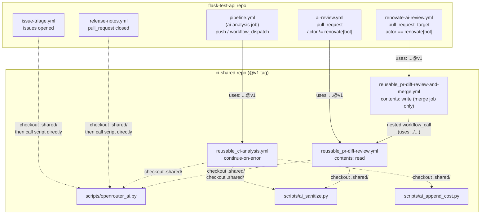
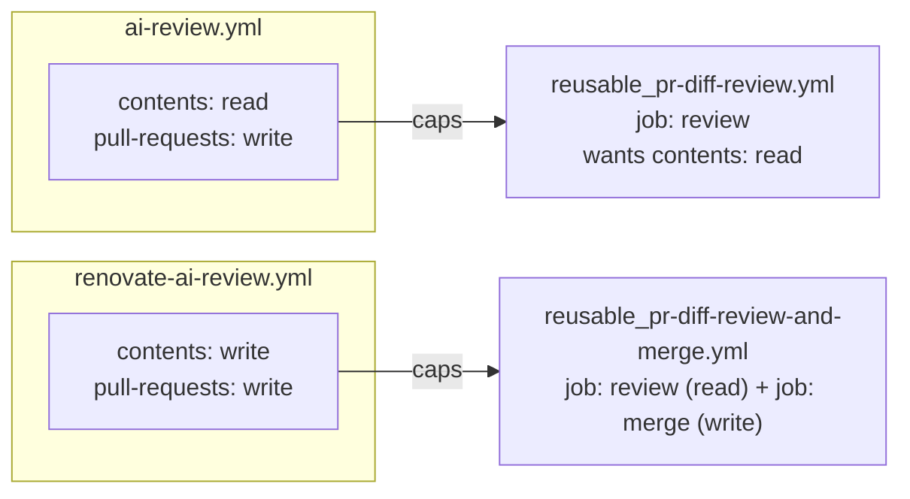
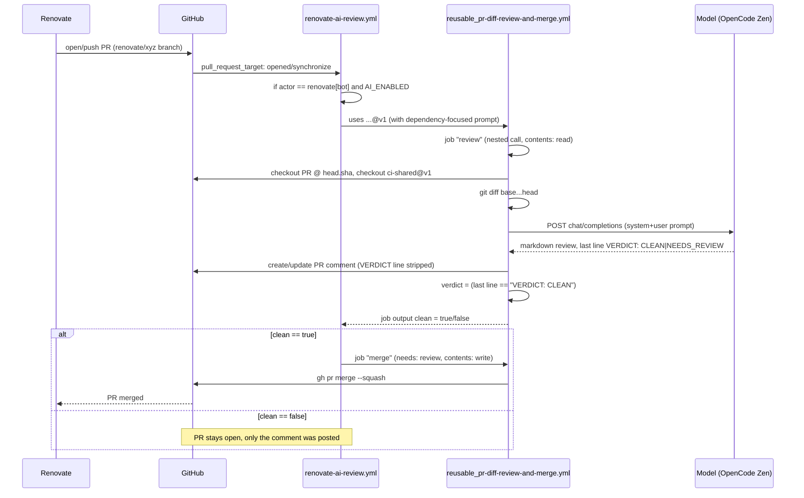

# ci-shared — Architecture

This repo centralizes reusable GitHub Actions workflows and their Python
scripts, so consumer repos (`flask-test-api`, and later others) stop
duplicating the same AI-review logic byte-for-byte. It was extracted after
finding `scripts/openrouter_ai.py` and most of `ai-review.yml` copy-pasted
identically between `flask-test-api` and `cloudflare-free-exporter`.

No Claude API, no Claude Code routines. Every call goes through
`scripts/openrouter_ai.py`, a stdlib-only Python client for any
OpenAI-compatible chat-completions endpoint (default: OpenCode Zen,
`https://opencode.ai/zen/v1/chat/completions`, model `deepseek-v4-flash-free`
— but that model has been intermittently unavailable; `flask-test-api`
currently overrides it to `hy3-free` via the `OPENROUTER_MODEL` repo
variable).

## Versioning

Consumers pin `@v1` (a moving tag on `main`), never `@main` directly. Every
`Checkout shared scripts` step inside the reusable workflows uses a
**literal** `ref: v1` — not a dynamically resolved ref. `github.workflow_ref`
inside a called reusable workflow resolves to the **caller's** ref (observed:
a consumer PR's merge ref, `refs/pull/88/merge`) — not the tag pinned in this
repo's own `uses:` line. There is no context value that reflects "the ref
this file was itself fetched at." Because the checkout step's `ref: v1` line
ships as part of the `v1` tag's own file content, bumping the tag and
updating that literal happen in the same commit by construction — they
cannot drift apart. (This was tried the dynamic way first; it failed with
`couldn't find remote ref refs/pull/88/merge` the first time a consumer's
`pull_request`-triggered run hit it.)

## Repo layout

```
ci-shared/
├── .github/workflows/
│   ├── reusable_pr-diff-review.yml           review + comment only
│   ├── reusable_pr-diff-review-and-merge.yml review + comment + auto-merge
│   ├── reusable_ci-analysis.yml              post-pipeline informative report
│   └── test.yml                              CI for this repo's own scripts
├── scripts/
│   ├── openrouter_ai.py    minimal OpenAI-compatible chat-completions client
│   ├── ai_sanitize.py      redact secrets / cap size before sending to the model
│   └── ai_append_cost.py   append a token-usage/cost footer to a report
├── tests/
│   └── test_openrouter_ai.py   13 tests, mocked HTTP server, no network calls
├── README.md               quick-start / inputs reference
└── docs/architecture.md    this file
```

---

## File: `scripts/openrouter_ai.py`

Stdlib-only (`urllib`, no `requests`), so it runs on any Ubuntu runner with
no `pip install` step. Reads config from the environment
(`OPENROUTER_API_KEY`, `OPENROUTER_MODEL`, `OPENROUTER_ENDPOINT`,
`OPENROUTER_SITE_URL`, `OPENROUTER_APP_NAME`), takes `--system-file` /
`--prompt-file`, prints only the model's reply to stdout.

Key behaviors:
- **Redaction is defense-in-depth**: the API key and common secret patterns
  (`sk-or-v1-…`, `ghp_…`, PEM blocks) are stripped from anything printed,
  even error messages.
- **Truncation**: both prompts are capped at `--max-chars`; oversized input
  is truncated with a marker, never silently dropped.
- **Empty-reply retry**: reasoning models can burn their entire output
  budget on chain-of-thought and return blank `content`. On that, it retries
  with a doubled `max_tokens` and an explicit "answer directly" nudge, up to
  `--retries` times (default 3), before falling back to the raw
  `reasoning_content` if that's all that came back.
- **Cost estimate**: `--usage-file` writes a JSON blob (tokens + estimated
  USD cost from a small hardcoded price table, `MODEL_PRICES_USD_PER_1M`)
  that `ai_append_cost.py` turns into a Markdown footer.

## File: `scripts/ai_sanitize.py`

Three independent modes selected by flag:
- **bundle** (default): concatenates input files, redacting secret patterns
  in each, caps total output at `--max-bytes`. Used to build the combined
  CI-context prompt for `reusable_ci-analysis.yml`.
- **`--check FILE`**: exit 1 if `FILE` contains a secret pattern, used
  nowhere currently that changes behavior — kept for pipelines that want a
  hard gate.
- **`--redact-file FILE`**: in-place mask, used on the **final AI report**
  before upload — a security review legitimately quotes source lines like
  `password = "x"`; this must never cause the whole report to be dropped,
  only the matched substrings masked.

## File: `scripts/ai_append_cost.py`

Pure formatting: reads the `--usage-file` JSON from `openrouter_ai.py` and
appends a `## 🤖 AI Usage & Cost` section to a report file.

---

## File: `.github/workflows/reusable_pr-diff-review.yml`

The core building block. `workflow_call` with:

| Input | Default | Purpose |
|---|---|---|
| `system_prompt_extra` | `''` | Caller-specific prompt addendum (e.g. "this PR is a dependency bump") |
| `comment_marker` | `<!-- ai-code-review -->` | HTML marker to find/update this bot's own comment (lets two callers coexist without fighting over one comment) |
| `comment_heading` | `AI Code Review` | Markdown heading shown above the review |
| `max_chars` | `140000` | Diff chars sent to the model |
| `timeout_seconds` | `120` | HTTP timeout |
| `openrouter_model` / `_endpoint` / `_site_url` / `_app_name` | `''` | Forwarded from the caller's repo vars — `workflow_call` does **not** inherit `vars.*` automatically |

Secret: `openrouter_api_key` (optional — empty means "skip the AI call, post
a did-not-run comment").

Output: `clean` — `"true"` only if the review ran **and** its exact last
line was `VERDICT: CLEAN`.

Job permissions: `contents: read`, `pull-requests: write`. **Never
requests `contents: write`** — this file is meant to be safe to run on
arbitrary/human/fork PRs, including from untrusted contributors.

### Steps (in order)

1. **Checkout caller repo** at `ref: github.event.pull_request.head.sha`
   explicitly — not the default ref. The default differs by trigger:
   `pull_request` checks out a synthetic merge commit
   (`refs/pull/N/merge`), `pull_request_target` checks out the **base**
   branch (not the PR at all). `head.sha` is the one ref that is correct
   for both, so the file behaves identically regardless of which trigger a
   caller uses.
2. **Checkout shared scripts** — `lorenzogirardi/ci-shared@v1` (literal, see
   Versioning above) into `.shared/`.
3. **Read project-specific review rules, if any** — if the *caller* repo has
   `.github/ai-review-rules.md`, its content becomes a `GITHUB_OUTPUT`
   multiline value, later appended to the prompt. This is the mechanism for
   a consumer to keep durable, project-specific review guidance (deprecated
   patterns, domain gotchas) **in its own repo**, not forked into this one.
4. **Prevent fork secret exfiltration** — if
   `github.event.pull_request.head.repo.fork == true`, blanks
   `OPENROUTER_API_KEY` in `$GITHUB_ENV` for the rest of the job. Untrusted
   fork code never gets a real key.
5. **Build diff** — `git diff base...head`, with a long `:(exclude)` list
   (secrets, binaries, `node_modules`, `dist`, etc.), capped and redirected
   to `.ai/diff.txt`.
6. **Create review prompts** (`actions/github-script`, not inline shell —
   PR title/diff content is untrusted, so it's written to files via the JS
   API rather than interpolated into a shell string). Builds the system
   prompt: base rules + `system_prompt_extra` + the rules file content +
   a fixed tail that defines the 8 review sections, the
   `[Critical]|[Warning]|[Suggestion]` tagging convention, and — since the
   verdict fix — a hard requirement that the **last line** of the entire
   response be exactly `VERDICT: CLEAN` or `VERDICT: NEEDS_REVIEW`.
7. **Append diff to review prompt**.
8. **Run AI review** — skips (with a `::warning::`) if the key is empty;
   otherwise calls `openrouter_ai.py`, writes `.ai/review.md`.
   `continue-on-error: true` — a failed model call never fails the job.
9. **Post or update AI review comment** — finds an existing comment by
   `comment_marker`, updates it, else creates one. Strips the `VERDICT:`
   line before posting (it's for the merge job, not a human reader). If
   `.ai/review.md` doesn't exist (skipped or failed), posts a
   "did not run" placeholder instead of silently doing nothing.
10. **Compute clean verdict** — `clean=true` only if `.ai/review.md` exists
    **and** `tail -n 1` of it is exactly the string `VERDICT: CLEAN`. Exact
    match, not a substring `grep` — see "Why exact-match, not grep" below.

### Why exact-match, not grep

The first version checked `grep -qi '\[critical\]' .ai/review.md`. That
false-positives on any sentence *mentioning* the tag — a model writing
*"no [Critical] issues found"* to say the PR is clean would still match and
block a merge for the wrong reason, and conversely a model that forgets the
exact bracket casing could produce a false clean. Forcing one dedicated,
mechanically-parsed last line (mirroring the strict-JSON pattern
`issue-triage.yml` already uses in `flask-test-api` for the same class of
problem — an automated decision reading model output) removes that
ambiguity entirely: either the last line is the exact string or it isn't.

---

## File: `.github/workflows/reusable_pr-diff-review-and-merge.yml`

Adds exactly one capability on top of the file above: merge the PR when the
verdict is clean. Kept as a **separate file**, not a boolean input flag on
the file above, because of a hard GitHub Actions constraint discovered while
building this: **a reusable workflow's declared job `permissions:` are
validated against the caller at parse time, for every job in the file,
regardless of any `if:` condition on that job.** A single file offering both
"just comment" (`contents: read`) and "comment and merge"
(`contents: write`) behind an input flag would force every caller —
including ones that only ever want a comment, like `ai-review.yml` on
arbitrary PRs — to grant `contents: write` merely because the *file*
declares it, whether or not that caller ever sets the flag. This actually
broke `ai-review.yml` in `flask-test-api` for real, with:

```
Error calling workflow 'lorenzogirardi/ci-shared/.github/workflows/reusable_pr-diff-review.yml@v1'.
The nested job 'review' is requesting 'contents: write', but is only allowed 'contents: read'.
```

### Structure

```
jobs:
  review:                      # nested workflow_call, SAME file as above
    uses: ./.github/workflows/reusable_pr-diff-review.yml
    with:  { ...forwarded inputs... }
    secrets: { openrouter_api_key: ... }

  merge:
    needs: review
    if: needs.review.outputs.clean == 'true'
    permissions:
      contents: write          # the ONLY job in either file that has this
      pull-requests: write
    steps:
      - run: gh pr merge <number> --<merge_method> --repo <repo>
```

`uses: ./.github/workflows/reusable_pr-diff-review.yml` is a **local**
reusable-workflow reference (same repo, resolved at the exact same commit as
the calling file — no separate `.shared` checkout needed for this
relationship specifically). GitHub allows nesting reusable workflow calls up
to 4 levels deep; this uses 1.

No `auto_merge_if_clean` input exists on this file — calling it at all means
"merge on a clean verdict." A caller that doesn't want that calls the plain
`reusable_pr-diff-review.yml` instead. Input `merge_method` (default
`squash`) is the only addition over the plain file's inputs.

**Use this only where merging on a clean AI verdict, unattended, is an
acceptable outcome** — a dependency bot's manifest/lockfile-only diff, not
human-authored application code.

---

## File: `.github/workflows/reusable_ci-analysis.yml`

Unrelated to the two files above — this is a **post-pipeline** informative
report, not a per-PR review. Downloads `ai-context-*` artifacts uploaded by
earlier jobs in the *same* workflow run (lint/test/trivy/checkov/k8s-probe
output — produced by jobs the caller defines, this file only consumes them),
bundles them with the app source via `ai_sanitize.py`, asks the model for a
security/quality report, writes it to the job summary and as an artifact.

`continue-on-error: true` is set **inside this reusable workflow's own job**
— a job that calls a reusable workflow (the caller side) cannot set
`continue-on-error` itself, so it has to live here instead.

Never gates the pipeline. Extracted from `flask-test-api/pipeline.yml`'s
`ai-analysis` job, which now just does:

```yaml
ai-analysis:
  needs: [build, docker, security-gate-trivy, docker-sbom, quality-gate, modifygit, k8s-check]
  if: always() && vars.AI_ENABLED == 'true'
  uses: lorenzogirardi/ci-shared/.github/workflows/reusable_ci-analysis.yml@v1
  with: { source_glob: app, openrouter_model: ..., ... }
  secrets: { openrouter_api_key: ... }
```

---

## Consumer side: `flask-test-api`

```
.github/workflows/
├── ai-review.yml            pull_request        → reusable_pr-diff-review.yml
├── renovate-ai-review.yml   pull_request_target  → reusable_pr-diff-review-and-merge.yml
├── pipeline.yml (ai-analysis job) push/dispatch  → reusable_ci-analysis.yml
├── release-notes.yml        pull_request(closed) → calls .shared/scripts/openrouter_ai.py directly
└── issue-triage.yml         issues(opened)       → calls .shared/scripts/openrouter_ai.py directly
```

`release-notes.yml` and `issue-triage.yml` don't fit either reusable-workflow
shape (one reacts to a merged PR to write release notes, the other reacts to
a new issue to triage it) — they just checkout `ci-shared@v1` into `.shared`
and invoke the script path directly, same dedup benefit without forcing them
into an unrelated abstraction.

### Why two review workflows, gated by actor

`flask-test-api`'s dependency bot is **Renovate** (`renovate.json`), not
Dependabot — confirmed the hard way (enabling native Dependabot alongside it
produced 12 duplicate PRs for updates Renovate already tracked; all closed,
`.github/dependabot.yml` removed).

`ai-review.yml` (`pull_request`, `contents: read`) handles everything
**except** `renovate[bot]`. `renovate-ai-review.yml`
(`pull_request_target`, `contents: write`) handles only `renovate[bot]`,
with a dependency-bump-focused `system_prompt_extra` and the merge
capability. Each explicitly excludes/includes on `github.actor` so a given
PR only ever gets **one** comment, not two:

```yaml
# ai-review.yml
if: vars.AI_ENABLED == 'true' && github.actor != 'renovate[bot]'

# renovate-ai-review.yml
if: vars.AI_ENABLED == 'true' && github.actor == 'renovate[bot]'
```

### Why `pull_request_target`, not `pull_request`, for Renovate

Two different restrictions, discovered in that order:

1. **Secrets/token, generically believed Dependabot-only.** GitHub gives
   `pull_request`-triggered runs a read-only `GITHUB_TOKEN` and no repo
   secrets when the PR's actor is `dependabot[bot]` — well documented.
   Turns out the same restriction is **not actually Dependabot-specific**:
   requesting `contents: write` on a `pull_request`-triggered run for
   `renovate[bot]` (also same-repo, also not a fork) was rejected identically:
   `"is only allowed 'contents: read'"`. `pull_request_target` always runs
   with the base repo's full token/secrets regardless of actor — that's
   what actually fixed it.
2. **Default checkout ref.** `pull_request_target`'s default checkout is the
   **base branch**, not the PR — see the `head.sha` fix in
   `reusable_pr-diff-review.yml` above. Without that explicit ref, switching
   triggers would have silently diffed the wrong thing (base against
   itself) instead of erroring loudly.

This workflow only ever reads the PR (diff) and merges via the GitHub API —
it never checks out and *executes* anything from the PR branch beyond
reading file contents for the diff, so it doesn't reopen the classic
`pull_request_target` arbitrary-code-execution hole (that hole requires
running the PR's own code/scripts with the elevated token, which nothing
here does).

---

## Diagrams

### Repo/file relationships



### PR review + merge decision flow

```mermaid
flowchart TD
    start(["PR opened / synchronized"]) --> actor{"github.actor?"}
    actor -- "renovate[bot]" --> rtrig["renovate-ai-review.yml<br/>trigger: pull_request_target"]
    actor -- "anyone else" --> htrig["ai-review.yml<br/>trigger: pull_request"]

    htrig --> reviewOnly["reusable_pr-diff-review.yml<br/>(contents: read)"]
    rtrig --> reviewMerge["reusable_pr-diff-review-and-merge.yml"]
    reviewMerge --> nestedReview["job: review<br/>(nests reusable_pr-diff-review.yml)"]

    reviewOnly --> steps
    nestedReview --> steps

    subgraph steps["shared steps (identical in both paths)"]
        direction TB
        s1["checkout PR @ head.sha"] --> s2["checkout ci-shared@v1 → .shared/"]
        s2 --> s3["read .github/ai-review-rules.md<br/>(if present in caller repo)"]
        s3 --> s4{"PR from a fork?"}
        s4 -- yes --> s5a["OPENROUTER_API_KEY = empty"]
        s4 -- no --> s5b["OPENROUTER_API_KEY = real"]
        s5a --> s6
        s5b --> s6["git diff base...head<br/>(secrets/binaries excluded)"]
        s6 --> s7["build prompt<br/>(base + system_prompt_extra + rules file)"]
        s7 --> s8{"API key set?"}
        s8 -- no --> s9skip["skip AI call<br/>::warning::"]
        s8 -- yes --> s9run["openrouter_ai.py<br/>→ .ai/review.md<br/>(continue-on-error)"]
        s9skip --> s10
        s9run --> s10["post/update PR comment<br/>(VERDICT line stripped)"]
        s10 --> s11{"review.md exists AND<br/>last line == 'VERDICT: CLEAN'?"}
        s11 -- yes --> outClean["job output: clean = true"]
        s11 -- no --> outDirty["job output: clean = false"]
    end

    outClean --> pathSplit{"which file called this?"}
    outDirty --> pathSplit
    pathSplit -- "reusable_pr-diff-review.yml<br/>(ai-review.yml path)" --> doneComment(["done — comment only,<br/>no merge job exists here"])
    pathSplit -- "reusable_pr-diff-review-and-merge.yml<br/>(renovate-ai-review.yml path)" --> mergeGate{"clean == true?"}
    mergeGate -- yes --> doMerge["job: merge<br/>gh pr merge --squash<br/>(contents: write)"]
    mergeGate -- no --> doneOpen(["done — PR stays open,<br/>only the review comment"])
```



### Permission model



GitHub validates every job's declared `permissions:` in a called reusable
workflow against what the **caller's top-level `permissions:` block**
grants — statically, at parse time, for every job in the file, independent
of any runtime `if:`. This is why the merge capability had to live in its
own file rather than behind an input flag: a flag doesn't change what a
file *declares*, only what it *does*, and declaration is what gets checked.

### Sequence: a Renovate PR from open to merge



## Divergence from `openwrt/actions-shared-workflows`

This design was scoped from `openwrt/actions-shared-workflows` (a real,
public repo — inspected directly, not assumed). It borrows the shape
(central repo, thin per-consumer wrapper workflows, per-repo prompt
customization) but diverges in mechanism:

| | openwrt/actions-shared-workflows | ci-shared (this repo) |
|---|---|---|
| Engine | Claude Code **routine** — a hosted agentic session with an MCP GitHub connector; the model decides which tools to call (`pull_request_read`, `list_commits`, `get_job_logs`, …) and how many steps to take | One fixed script: checkout → diff → single chat-completions HTTP call → text parse → comment. No tool-use, no multi-step reasoning |
| Where the logic lives | Mostly **outside git** — the workflow YAML just `curl`s a `/fire` endpoint; the actual prompt/orchestration lives in the routine, edited via the claude.ai UI | Entirely **in git** — YAML + Python, versioned, diffable, no external UI holds behavior this repo doesn't also have committed |
| Output format | A native **GitHub PR Review** (`pull_request_review_write`) with inline, line-anchored comments, via a dedicated bot account with the Claude GitHub App installed | A plain PR **comment** via `GITHUB_TOKEN` + `actions/github-script` — no inline line comments |
| Catch-up / dedup | A second, cron-scheduled **nightly digest** job re-reconciles PRs with new commits since the bot's last review (SHA comparison), so a missed trigger self-heals | Purely event-driven (`opened`/`synchronize`/`reopened`) — no catch-up if a trigger is ever missed |
| One-time setup | Manual, outside version control: dedicated bot GitHub account, GitHub App install, routine creation via UI, trigger-token generation | Fully declarative: two repo variables + one secret already existed; adding the capability is just a workflow file |
| **Auto-merge** | **Never merges.** Explicitly human-in-the-loop for the merge decision — the routine only posts findings | **Does merge**, on a clean `VERDICT: CLEAN`, for the Renovate path specifically — an intentional addition beyond what openwrt does, built on request in this project |

The auto-merge behavior is the one divergence that isn't just "simpler
implementation of the same idea" — it's additional scope openwrt's own
design deliberately does not take on.

## Known-fragile points / open follow-ups

- **Model availability**: `deepseek-v4-flash-free` on OpenCode Zen has gone
  fully unavailable (`Error from provider (Console): Upstream request
  failed: Model is unavailable.`) more than once during development.
  `flask-test-api` currently pins `OPENROUTER_MODEL=hy3-free` as a working
  alternative found by testing `curl` against `/v1/models` directly. No
  automatic fallback/retry-on-different-model exists yet.
- **No branch protection on `flask-test-api`'s `main`** — the auto-merge
  path has nothing else gating it (no required status checks, no required
  review count). The AI verdict is the only gate. Acceptable for a
  dependency-manifest-only diff; would not be for application code.
- **`ai_sanitize.py --check` mode** is implemented but not wired into any
  current workflow step — kept for a future hard-gate use case.
- **Only `flask-test-api` migrated.** `cloudflare-free-exporter` still has
  its own copy of `openrouter_ai.py` and a near-identical `ai-review.yml`
  with a domain-specific prompt (Cloudflare Analytics API / Prometheus
  exporter concerns) — a candidate for the same extraction, not yet done.
