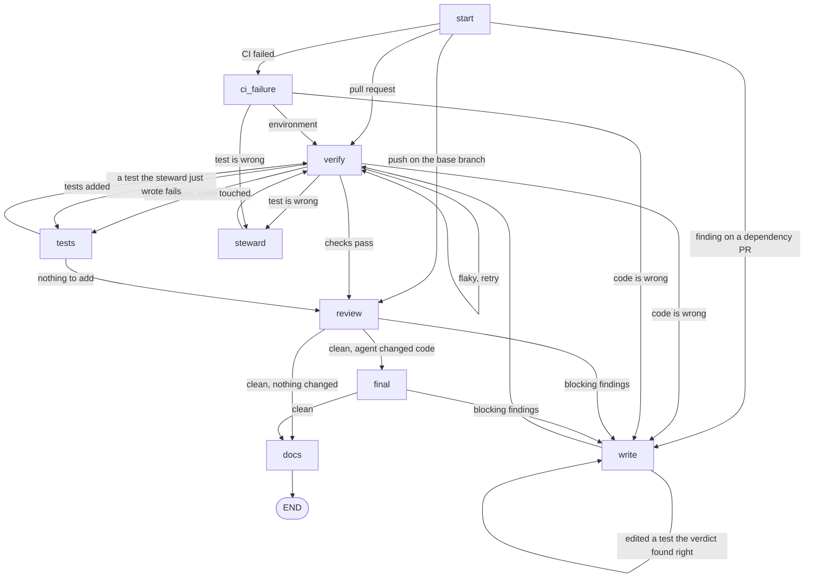
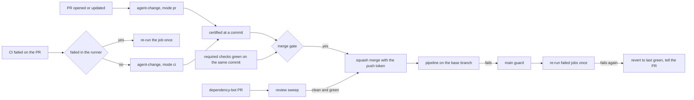

# ci-shared — Architecture

How the pieces of this repository fit together and why they are shaped the way they are.
The [README](../README.md) is the quick reference (inputs, wrapper examples, setup); this is the
explanation. A consumer's view of the same system is in
`flask-test-api/docs/13-agent-pipeline.md`.

## What this repository is

One place for the logic of an agentic CI loop, used by other repositories through thin caller
workflows. A consumer keeps only triggers and parameters; the workflows, the scripts and the prompts
live here. Model calls go through one stdlib-only client and any OpenAI-compatible chat-completions
endpoint; the model is whatever `OPENROUTER_MODEL` names.

The goal the design serves: **a change ends merged, abandoned or reverted, and none of the three waits
for a person.** Everything below follows from that, and from one rule: *if a command can prove
something, ask the command, not the model.*

## Repository layout

```
ci-shared/
├── .github/workflows/
│   ├── reusable_agent-change.yml      review, repair, certify a pull request or a push (the engine)
│   ├── reusable_agent-merge.yml       merge gate: certified and green on the same commit
│   ├── reusable_agent-main-guard.yml  base branch red after a merge: re-run once, then revert
│   ├── reusable_pr-review-sweep.yml   dependency-bot pull requests: review, repair, merge
│   ├── reusable_pipeline-health.yml   the loop checks itself (no model)
│   ├── reusable_pipeline-canary.yml   known changes through the real loop, outcome checked
│   ├── reusable_changelog.yml         deterministic changelog entry
│   ├── reusable_ci-analysis.yml       informative report after a pipeline run
│   ├── reusable_docs-architect.yml    documentation proposal, plan only
│   ├── reusable_agent-pipeline.yml    the engine started from a written request (planner first)
│   ├── reusable_agent-review.yml      reviewers A and B only, one comment
│   ├── reusable_pr-diff-review.yml    single-reviewer comment on a diff
│   ├── agent-change.yml, agent-ci-failure.yml, agent-merge.yml   this repository under its own loop
│   ├── release-tag.yml                moves v2 after the tests and the consumer's canary pass
│   └── test.yml                       this repository's tests
├── prompts/
│   ├── agents/*.md                    one prompt per agent role
│   └── pr-review-system.md            base prompt of the single-reviewer path
├── scripts/
│   ├── agent_pipeline.py    the engine: a LangGraph state machine, and the commands around it
│   ├── agent_lib.py         parsing, patches, guards, evidence, isolated verification
│   ├── pr_review_sweep.py   the dependency sweep, and helpers the engine reuses
│   ├── pipeline_health.py   the health check
│   ├── pipeline_canary.py   the canary
│   ├── openrouter_ai.py     the model client
│   ├── ai_sanitize.py, ai_append_cost.py, render_prompt.py, changelog_update.py
│   └── requirements-autofix.txt   the one non-stdlib dependency (langgraph)
├── tests/                   no network, no real `gh` calls
└── docs/architecture.md     this file
```

## The engine

`scripts/agent_pipeline.py` builds one `StateGraph`. The same graph serves every entry point; a
`start` node picks where to begin.


```mermaid
flowchart TD
    S[start]
    S -->|pull request| V[verify]
    S -->|CI failed| C[ci_failure]
    S -->|push on the base branch| R[review]
    S -->|finding on a dependency PR| W[write]
    W --> V
    W -->|edited a test the verdict found right| W
    V -->|checks pass, code touched| T[tests]
    V -->|checks pass| R
    V -->|code is wrong| W
    V -->|test is wrong| ST[steward]
    V -->|flaky, retry| V
    V -->|a test the steward just wrote fails| T
    T -->|tests added| V
    T -->|nothing to add| R
    ST --> V
    C -->|code is wrong| W
    C -->|test is wrong| ST
    C -->|environment| V
    R -->|blocking findings| W
    R -->|clean, nothing changed| D[docs]
    R -->|clean, agent changed code| F[final]
    F -->|blocking findings| W
    F -->|clean| D
    D --> E([END])
```

| Node | Role | May change |
|---|---|---|
| `write` | The writer explores read-only (`list`, `find`, `grep`, `read`), then proposes a patch | Code and tests, through a validated patch |
| `verify` | Runs the consumer's verify command in a process with no secrets | Nothing (reverts a patch that fails) |
| `ci_failure` | As `verify`, starting from the real logs of a failed CI run | Nothing |
| `steward` | The test steward updates tests a verdict found wrong | Tests only |
| `tests` | The test steward checks that changed code is covered | Tests only |
| `review` | Reviewers A and B in parallel, validated and deduplicated | Nothing |
| `final` | Checks the earlier findings are fixed, looks for regressions | Nothing |
| `docs` | Documentation reviewer, then a deterministic changelog entry | Documentation and changelog |

Every node writes a `route` into the state. The graph runs once; if it does not converge it runs once
more with twice the budget (`RETRY_BOOST`), continuing from what the first attempt committed. After
that the outcome is `abandoned`. Loops are bounded by `max_iterations`, `max_verify_retries` and
`writer_rounds`.

### How an agent's reply is used

A prompt ends with "reply with one JSON block". `agent_lib.ask_json` parses it, validates it against the
role's schema and discards anything else; on a malformed reply the model is shown its own answer and
asked to fix the format once. The model proposes, the code decides:

- **Patches** (`parse_changes`, `apply_changes`): at most 8 changes, each an edit anchored on text that
  appears exactly once in the file, or a whole new file. All or nothing. `validate_patch` refuses a
  credential-shaped string, a file the plan put out of scope, and protected paths (`.github/workflows/`,
  `.git/`, `.env*`, keys and certificates).
- **Findings** (`parse_findings`, `validate_findings`): each needs a severity, a file, a line inside a
  changed hunk, the evidence and a fix. A finding on a line the diff does not contain is dropped; two
  about the same place and topic are merged. `critical` and `high` block.
- **Verdicts** on failing tests: see the next section.

### When a check fails: the code or the test

1. `parse_failed_tests` reads the failing tests from the output (CI logs carry a timestamp before every
   line; the pattern allows for it).
2. `gather_evidence` re-runs each one on the current tree, twice, and on the base commit in a separate
   worktree. The hint is `flaky`, `unreproducible`, `new_test`, `preexisting` or `regression`. An
   interpreter that cannot run pytest is "unreproducible", never "failing"; when nothing can be
   reproduced the verify command is run once to prepare the job, and the evidence is gathered again.
3. The failure adjudicator classifies each test: `code_defect` (the default), `test_defect`,
   `environment`, `preexisting`.
4. `apply_rules` has the last word. Evidence overrides the model. `test_defect` stands only if the model
   quoted the stated intent of the change: every piece of the quote (pieces may be joined by `...`) must
   be in the title or description word for word (`quote_stands`). Otherwise it becomes `code_defect`.

Then: `code_defect` goes to the writer, `test_defect` to the steward, `environment` back to `verify`.

### Rules enforced in code

- **Tests are the specification, for the writer too.** After a `code_defect` verdict the writer may not
  edit the file of the failing test; such a patch is reverted and refused, and a second one ends
  without certification.
- **Tests only get stronger** (`weakened_tests`): a patch that deletes a test file, lowers the number of
  tests or assertions in a file, or adds `skip`/`xfail` is reverted, whoever proposed it.
- **A test an agent has just written is not the specification.** If tests the steward wrote or rewrote
  fail, they are discarded and the steward is asked again with the output. The application is not
  changed to satisfy them.
- **An agent that cannot answer blocks the certification** (`usable_changes`): the steward and the
  documentation reviewer get one more attempt, told exactly what was wrong; then the run ends not
  certified.
- **Agent instructions are not documentation**: `CLAUDE.md`, `AGENTS.md` and `.claude/` are outside
  the documentation reviewer's reach.
- **A last deterministic gate** (`policy_violations`) runs over the commits the agents made: protected
  or binary files, a credential in an added line, more than 60 files or 3000 lines, weakened tests.

### Credentials

- The step that runs the agents has the model key and no write token.
- The verify command and every pytest run execute with an allow-listed environment
  (`scrubbed_env`), from a checkout that keeps no credentials: the code they run was written by a
  model moments ago.
- Only the publish step holds the push token, and it runs no code from the repository.

## From verdict to merge

**Certification.** When the graph ends clean, `publish-pr` posts one comment on the pull request with
`<!-- agent-certified: <sha> -->` for the head commit; an abandonment carries
`<!-- agent-abandoned: <sha> -->` and the label `agent-abandoned`. Both are bound to the commit: a new
push starts a new attempt. A run whose commit is no longer the head publishes nothing. A commit written
by the agents is not reviewed again when it carries a verdict; one without is (at most 3 in a row).

**One agent at a time.** The caller for `mode: pr` and the caller for `mode: ci` share a concurrency
group per pull request, so when the checks fail the run that holds the real CI logs takes over.

**The merge gate** (`merge-gate`, `reusable_agent-merge.yml`) merges a pull request only if it is open,
not a draft, not from a fork, its base is the gate's branch, its head commit is certified by a trusted
account, the required checks succeeded on that same commit (`checks_state`: each named check present
and `success`; `skipped` does not count, a missing one is `pending`), and fewer than `max_reverts`
automatic reverts landed in 24 hours. It runs on every CI completion, on every push to the base branch
and on a schedule, each time over every open pull request, so no event has to be caught.

**The guard** (`main-guard`, `reusable_agent-main-guard.yml`) reacts to a failed pipeline on the base
branch. It re-runs the failed jobs once. If the failure repeats, was not already repaired by a later
green run, and comes from a job a code change can cause (`CODE_JOBS`), it reverts every change since
the last green run in one commit, leaving the pipeline's own bookkeeping commits alone, and says so,
with the lines of the log that say what failed, on the pull request each change came from (label
`agent-reverted`). It never reverts a revert. Reverted is an ending: no issue is opened and nothing is
redone automatically.


```mermaid
flowchart LR
    PR[PR opened or updated] --> AC[agent-change, mode pr]
    CIF[CI failed on the PR] --> INF{failed in the runner}
    INF -->|yes| RR[re-run the job once]
    INF -->|no| ACI[agent-change, mode ci]
    AC --> CERT[certified at a commit]
    ACI --> CERT
    CERT --> MG{merge gate}
    CI[required checks green on the same commit] --> MG
    MG -->|yes| MERGED[squash merge with the push token]
    BOT[dependency-bot PR] --> SW[review sweep]
    SW -->|clean and green| MERGED
    MERGED --> PIPE[pipeline on the base branch]
    PIPE -->|fails| GUARD[main guard]
    GUARD --> RERUN[re-run failed jobs once]
    RERUN -->|fails again| REVERT[revert to last green, tell the PR]
```

## The dependency sweep

`pr_review_sweep.py` handles the pull requests of a dependency bot, which the consumer's caller for
`mode: pr` leaves to it. For each open pull request of the configured authors:

1. **Behind the base branch** (counted from the commits through the compare API, ignoring bookkeeping
   commits): the bot is asked to rebase its own branch (label `rebase`), and the pull request is
   judged after its CI has run on current code.
2. **Touches `.github/workflows/`** (`workflow_prs_to_bot`): left to the bot's own automerge, which
   has the permission; abandoned if its checks are red on current code.
3. **CI red**: the engine is started at `ci_failure` with the failing logs, with guidance for a
   dependency migration (fix the call site rather than the pin; grep for every use of a renamed
   symbol). The push token is taken out of `.git/config` while the pull request's code runs.
4. **CI green**: reviewers A and B judge the diff with the results of the deterministic checks of that
   commit as evidence. A blocking finding goes to the writer loop (`fix_findings`); a clean verdict
   merges.
5. `max_autofix_commits` automatic fixes in a row that did not help: abandoned and closed.

Each pull request has one comment, updated in place, with the reviewed commit and the verdict, so a
sweep that finds nothing new costs nothing.

## Who watches the loop

With no person in it, nobody notices when a piece of the loop silently stops. Two workflows do, and
neither is an agent.

**Health** (`pipeline_health.py`, every 30 minutes, no model) exits 1 and says why when:

- a commit is on the base branch and no build covers it (it then starts the build);
- a pull request was certified although an agent could not do its job (reported for one day);
- an agent workflow is failing now, meaning a failed run with no successful run of the same workflow
  after it;
- an open pull request has no verdict on its head commit and nothing has run on it for 90 minutes (it is
  then abandoned, which is an ending; a new push starts a new attempt).

**Canary** (`pipeline_canary.py`, nightly) opens the scenarios of the consumer's `.github/canary.json`
as real pull requests against a throwaway copy of the base branch, lets the ordinary workflows run,
waits for a verdict on the final commit and for the required checks, then checks facts: the verdict,
the checks, which files the pull request changes, what a file contains, and what the agents' report
says (the right files can be reached by the wrong verdict). Then it closes the pull requests and deletes
the branches. Because the merge gate only merges into its own base branch, a canary is never merged.

## Releasing this repository

Consumers call the workflows at the tag `v2`, and those workflows check the scripts and prompts out at
the same tag, so a consumer always runs one coherent version. `release-tag.yml` moves the tag, forwards
only, in two steps:

1. `Test scripts` passed on that exact commit of `main`.
2. The consumer's canary passed against it. The commit is published as `v2-next`; the canary of the
   repository named in the variable `ENGINE_GATE_REPO` is started in candidate mode
   (`repository_dispatch`); its pull requests target a base branch named `canary/next-*`, and for those
   `reusable_agent-change.yml` checks the scripts out at `v2-next`. If a scenario does not hold, `v2`
   stays where it is and the run is red.

Step 2 exists because unit tests do not show what a model does with a real pull request.

Pull requests to this repository go through the same loop (`agent-change.yml`,
`agent-ci-failure.yml`, `agent-merge.yml`), with the agents running at the released tag, never at
the pull request's own code. What stays with a person: a pull request that touches
`.github/workflows/`, and a breaking change that needs a new tag.

## Constraints of GitHub Actions that shape the design

These are the reasons behind choices that otherwise look arbitrary.

- **An event made with the job's `GITHUB_TOKEN` starts no workflow.** A push or a merge made with it
  builds no image and leaves the guard blind. So fixes are pushed, and pull requests merged, with a
  separate push token (`AUTOFIX_PUSH_TOKEN`, Contents read/write, never the `workflow` scope).
- **A pull request opened with the job token starts no checks either.** The canary and the fix after a
  direct push open the pull request with the job token (the push token is not required to be able to),
  then push one commit with the push token, which starts them. The repository must allow Actions to
  create pull requests.
- **No token without the `workflow` scope can change `.github/workflows/`.** No agent has that scope,
  by choice: an agent that can edit the CI that controls it cannot be left alone.
- **A `pull_request` run for a bot author gets a read-only token and no secrets.** That is why the
  dependency sweep is triggered by CI completion, pushes and a schedule, never by the bot's own
  `pull_request` event.
- **A reusable workflow cannot be granted more than its caller grants, and a caller that grants less
  does not start.** When a change here needs a new permission, the callers are updated first.
- **Inside a reusable workflow there is no context for "the ref this file was fetched at"**
  (`github.workflow_ref` is the caller's). The scripts are therefore checked out at a literal tag.
- **Only a completed run can have its failed jobs re-run.** That is why the guard is a separate
  workflow started by the pipeline's completion, not a job inside it.
- **Runs started by `workflow_run` are listed under the default branch.** The callers set a `run-name`
  that carries the pull request's title.

## The scripts that are not the engine

- **`openrouter_ai.py`**: stdlib only. Reads its configuration from the environment, prints only the
  model's reply. It redacts the key and secret-shaped strings from everything it prints, truncates
  oversized prompts with a marker, gives a reasoning model's thinking its own allowance
  (`reasoning.max_tokens`, 6,000 by default) so the answer keeps its budget, retries an empty reply with
  at most four times the first budget, and writes the tokens and estimated cost of every attempt to
  `--usage-file`.
- **`ai_sanitize.py`**: bundles files into a prompt with secrets redacted and a size cap, or masks
  secret patterns in a finished report.
- **`render_prompt.py`** and **`prompts/pr-review-system.md`**: the base prompt of the single-reviewer
  path, with a placeholder a caller fills with its own context and an optional rules file from the
  consumer. Its reply must end with a line that is exactly `VERDICT: CLEAN` or `VERDICT: NEEDS_REVIEW`;
  the line is compared whole, because a substring match would read a sentence that merely mentions a
  verdict as the verdict.
- **`changelog_update.py`**: one entry per push to the base branch, from the commit subject, no model.
- **`reusable_ci-analysis.yml`**: downloads the context artifacts earlier jobs of the same run
  uploaded, asks for a security and quality report, writes it to the job summary. It never gates
  anything.

## Tests

`pytest tests/`, about 450 tests, no network. The engine's graph runs against real throwaway git
repositories with a scripted model; the merge gate and the guard against a local bare remote; the
health check and the canary on recorded shapes of the API. A test enumerates the terminal states and
fails if one of them hands work to a person.

What the tests do not show is what a model does with a real pull request. That is the canary's job,
and the reason a release waits for it.

## Limits

- The guarantee is as strong as the consumer's checks: a defect none of them sees will merge, and the
  guard limits the damage afterwards.
- The engine assumes a Python project tested with pytest (`parse_failed_tests`, `run_pytest`,
  `weakened_tests`).
- The verify command is written by the consumer. If it is looser than the consumer's real CI, an agent
  can push a commit that passes locally and fails in CI; the CI path then takes over.
- The canary covers the scenarios the consumer wrote. A defect none of them exercises is not seen
  before a release.
- A description is part of the input. One that promises behaviour the code does not have sends the
  agents looking for it; the rules keep the outcome safe, but the change may be abandoned.
- `v2` is a moving tag that receives the consumers' secrets: what lands on `main` here and passes the
  release steps runs with their credentials.
